# NGS (Network Game Server)
A web server for playing turn based games over websockets.

The client server interaction generally follows this:

Trying to setup a connection looks something like this:

